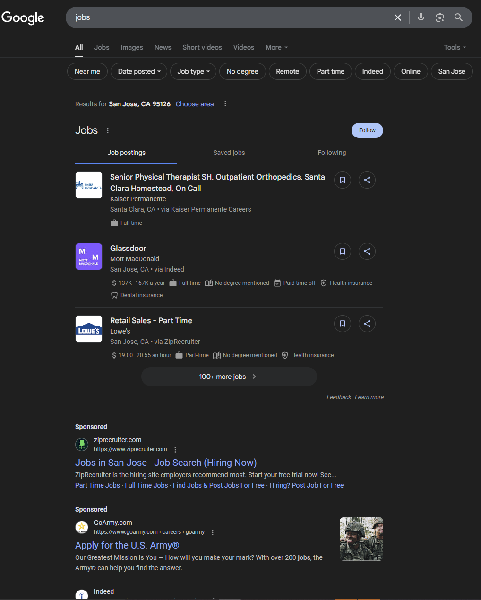
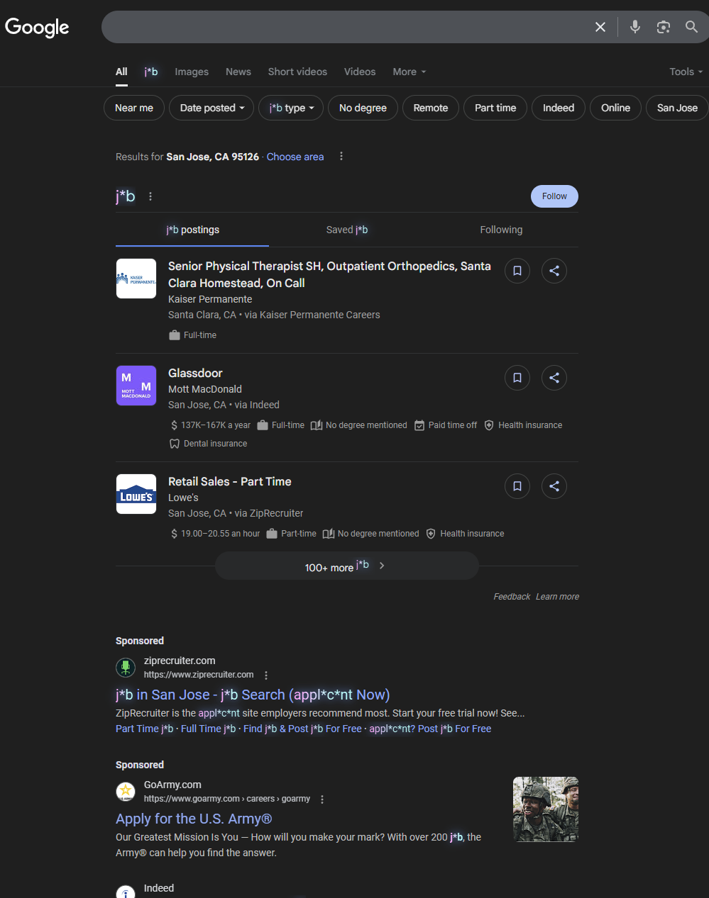

# 🧠 Job Censor – The Anti-Employment Browser Extension

> Censors the most cursed terms on the internet:  
> **job**, **salary**, **work**, **application** – GONE. Banished. Vaporized.

---

## 🖼️ Before & After

| **Before** | **After** |
|:--:|:--:|
|  |  |

> *Left: A Google search for “software engineering job”.  
> Right: Same search, but Job Censor working overtime to protect your soul.*

---

## ❌ What is this?

Tired of LinkedIn trauma? Sick of unsolicited career advice?  
Seeing the word `job` in the wild is a violation.  
So we made **Job Censor** – a browser extension that automatically censors the worst of corporate vocabulary.

Built for those who do **not** dream of labor.

---

## 🧠 Features

Job Censor uses ✨ advanced ✨ find-and-replace to scramble your browsing experience:

- `job` → `j*b`
- `work` → `w*rk`
- `salary` → `s****y`
- `application` → `applic*tion`
- `hiring`, `resume`, `position`, `career`, etc... → obliterated

Want to add more? You totally can. But also: why are you trying so hard?

---

## 🛠️ Built With

- [**Plasmo**](https://docs.plasmo.com/) – for modern browser extension tooling  
- JavaScript, HTML, vibes  
- Zero ambition

---

## 📦 Installation

### 🔧 Prerequisites

- [Node.js](https://nodejs.org/) **v18 or higher**
- [`pnpm`](https://pnpm.io) (or `npm`, if you're feeling chaotic)

---

### 🧪 Local Setup

```bash
git clone https://github.com/yourusername/job-censor.git
cd job-censor
pnpm install
pnpm build
